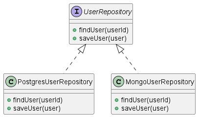

# [Código Sostenible](https://savvily.es/libros/codigo-sostenible/)
- Autor: Carlos Blé Jurado
- Sinopsis: Cómo programar código fácil de mantener. El libro que nos hubiera gustado tener entre nuestras manos cuando estábamos aprendiendo a programar. Una guía para quienes buscan la satisfacción del código bien hecho. ¿Te has planteado alguna vez cómo sería programar sin prisas, sin parches y sin chapuzas? Tras veinte años de carrera como programador, consultor, conferenciante y formador, Carlos Blé plasma lo mejor de sus enseñanzas en este libro.
- [Drive](https://drive.google.com/drive/u/0/folders/1IWfBkgh8gPGC7-m5iiatyzs_T8UY_1Fy)

## Índice:
- [Código Sostenible](#código-sostenible)
  - [Índice:](#índice)
  - [1. ¿Qué es código sostenible?](#1-qué-es-código-sostenible)
    - [La degeneración del código](#la-degeneración-del-código)
    - [¿Por qué es tan importante la sostenibilidad?](#por-qué-es-tan-importante-la-sostenibilidad)
    - [Las personas primero](#las-personas-primero)
  - [2. Refactorización](#2-refactorización)
  - [3. Fundamentos](#3-fundamentos)
    - [Diseñar código para el presente](#diseñar-código-para-el-presente)
      - [**Ejemplo**: generalizaciones prematuras y cargantes:](#ejemplo-generalizaciones-prematuras-y-cargantes)
    - [Diseñar para el uso concreto, no para reutilizar](#diseñar-para-el-uso-concreto-no-para-reutilizar)
    - [Las reglas del código sostenible](#las-reglas-del-código-sostenible)
      - [1. El código está cubierto por test](#1-el-código-está-cubierto-por-test)
      - [2. Los test son sostenibles](#2-los-test-son-sostenibles)
      - [3. Las abstracciones tienen sentido](#3-las-abstracciones-tienen-sentido)
      - [4. Hay una intencionalidad explícita](#4-hay-una-intencionalidad-explícita)
  - [4. Técnicas para elegir nombres](#4-técnicas-para-elegir-nombres)
    - [Nombres fáciles de pronunciar](#nombres-fáciles-de-pronunciar)
    - [Sin información técnica](#sin-información-técnica)
    - [Nombres concretos](#nombres-concretos)
    - [Nombres que forman frases](#nombres-que-forman-frases)
    - [Sin alias](#sin-alias)
    - [Nombres que se apoyan en el contexto](#nombres-que-se-apoyan-en-el-contexto)
    - [Distinguir sustantivos, verbos y adjetivos](#distinguir-sustantivos-verbos-y-adjetivos)
    - [Darle nombre a los valores literales](#darle-nombre-a-los-valores-literales)
    - [Renombrar al día siguiente](#renombrar-al-día-siguiente)
  - [5. Principio de menor sorpresa](#5-principio-de-menor-sorpresa)
    - [La brújula del código sostenible](#la-brújula-del-código-sostenible)

## 1. ¿Qué es código sostenible?

El código sostenible es **aquel que se puede mantener fácilmente a lo largo del tiempo**. Para ello, es necesario que su diseño sea **intuitivo**, que su **complejidad sea la mínima** imprescindible y que esté **bien cubierto por pruebas automatizadas**.

### La degeneración del código
Cuanto **más retorcida es la solución** implementada, **más degenera el código y más cuesta revertir la situación**. Puede llegar el momento en que todo el equipo se dé por vencido y entonces decida que la mejor solución es tirarlo todo abajo y empezar el desarrollo desde cero, volviendo al glorioso estado de greenfiel (o proyecto vacío).

¿Cómo evitar la degeneración? Hace **falta que el código sea sostenible**, lo cual requiere, entre otras cosas, que tenga una **cobertura de test** decente. *Sin test no hay gloria*.

¿Es posible reconducir un proyecto en el que hemos perdido el control? **Perder el control** significa **no tener ni idea de lo que vamos a tardar en hacer cambios**, ni en lo que va a **dejar de funcionar** cuando los hagamos o tan siquiera **dónde hay que aplicarlos**.

### ¿Por qué es tan importante la sostenibilidad?
Primero, porque se espera que hagamos un trabajo técnico de excelente calidad. La **mejor manera de ofrecer soluciones ágiles y adaptadas** a sus problemas es mediante el **asesoramiento**, el **acompañamiento** y la **entrega continua de software que funciona**. Es **imposible entregar software robusto** con la cadencia adecuada, **si su diseño y su código son insostenibles**.

**Por más rápido que queramos ir**, cuando alcanzamos varios miles de líneas de código que **no están respaldadas por test**, **cuesta entender y cambiar**; nos volvemos lentos e impredecibles. El tiempo se esfuma depurando bugs o intentando comprender código. Cuanto más queremos correr, más empeoramos el código y más tardamos en dar respuesta al negocio. Lo que al principio tomaba días, ahora supone meses, y cada modificación del código tiene efectos secundarios insospechados, rompiendo con funcionalidades existentes sin que nos demos ni cuenta de ello.

Hoy los equipos de desarrollo de las tecnológicas de éxito programan con test automáticos de calidad, diseñan arquitecturas adaptadas a su contexto y escriben el
código para que cualquier persona del equipo lo pueda modifica. **Cuando escribo código con la intención de ser explícito, simple y conciso**, siento que contribuyo al bienestar de la empresa, de las personas que trabajan en ella y de las que vendrán en el futuro.

### Las personas primero
La calidad del código es importantísima para la sostenibilidad del desarrollo, aunque me gustaría resaltar que **la calidad de la relación
entre las personas es todavía más importante**. Un grupo de personas que trabaja en equipo siempre llegará más lejos que un individuo, por más voluntad que este le ponga. **El cuidado del código no puede estar por encima del cuidado de las relaciones y las personas**.

La falta de **inteligencia emocional, de empatía, de actitud, de conocimiento, de capacitación**… son las **principales amenazas** de los proyectos; son incluso la principal amenaza para cualquier organización. Un lema que me gusta recordar es, *«firme con el asunto, pero flexible con la persona»*.

## 2. Refactorización
Estas **pequeñas mejoras de legibilidad** que aplicamos al código se conocen como **refactorización o refactoring**.
  - Conforme he terminado de escribir un bloque y funciona, **lo vuelvo a leer** buscando si se puede escribir de forma más explícita.
  - Cada día al empezar la jornada,** dedico diez minutos a leer el código del día anterior**, y para mi sorpresa, a veces me da la sensación de que lo hubiera escrito otra persona. Lleva muy poco tiempo aplicar cambios pequeños y seguros con el apoyo de un IDE.
  - **Conforme he terminado la funcionalidad** (tarea, requisito, historia de usuario…), **repaso todo el código de la misma**, buscando posibles sorpresas que haya podido dejar.
  - Generalmente, programo con otra persona (pair programming). Si la persona que escribió el código necesita explicárselo a la otra, ella
misma se da cuenta de cómo lo puede mejorar. Por otro lado, si la persona que está leyendo el código de la compañera no lo entiende, aprovecha para preguntar y juntas lo mejoran.

Si en un proyecto nuevo **practicas refactorización a diario**, podrás seguir dedicando la mayor parte del tiempo a implementar la funcionalidad. El tiempo refactorizando no será significativo. La táctica que recomiendo para aplicar refactorización es **priorizar aquellos cambios que producen el máximo retorno de inversión con el menor riesgo.**
  - **Sustituir un nombre** por otro más apropiado aumenta significativamente la expresividad, además de ser un cambio trivial con mínimo riesgo.
  
Piensa en la refactorización como en una tarea cotidiana tal como dejar tu escritorio recogido, en lugar de abordarla como una macro reforma de una casa.
El código que ha sido desarrollado sin el apoyo de test, es típicamente difícil o imposible de testar, con lo cual entramos en un círculo vicioso de ausencia de refactorización y de test. **Borrar y volver a escribir hasta que el código sea legible es mucho más barato que seguir adelante con un código enrevesado**.

## 3. Fundamentos
### Diseñar código para el presente
En el mundo de la programación existe una idea muy arraigada y extendida, que es la de escribir el código tan genérico, abstracto y complejo, que pueda resolver los problemas del futuro sin tenerlo que cambiar. Escribir código para el futuro es un concepto mal entendido. 

**El código más preparado para el futuro resulta ser el que se ciñe a lo estrictamente necesario para cumplir con los requisitos del presente.** Es minimalista, simple, conciso, concreto, explícito y está bien respaldado por baterías de test automáticos.

**Los requisitos no funcionales deben cumplirse también en el presente y soportar lo que se sabe con certeza que sucederá en el futuro próximo**. Es difícil encontrar el punto óptimo de inversión en las características no funcionales del software; **se necesita que las áreas de negocio y de tecnología estén muy alineadas y entiendan mutuamente** las consecuencias de sus decisiones.

Hay una táctica que arruina el código: *«Ya que estoy escribiendo estas líneas por aquí, implemento algo más que no me han pedido, por si acaso me lo piden luego»*. Sale mucho más barato consensuarlo con las personas que entienden el negocio. 

Al software le ocurre lo contrario que a un gran proyecto convencional, **si el código es simple, cuesta muy poco hacer rectificaciones o ampliaciones.** Trabajamos con unos materiales extremadamente maleables, el cerebro humano y el código fuente. Cuanto más flexibles sean estos materiales, más fáciles y baratas resultarán las obras. **Cuanto más sostenible sea el diseño del software, más valor tendrá en el presente y en el futuro.**

#### **Ejemplo**: generalizaciones prematuras y cargantes:
Uno que he visto varias veces es la validación de fortaleza de una contraseña:
```java
public boolean isStrongPassword(String password) {
    return isLongEnough(password) &&
           containsLowercaseChar(password) &&
           containsUppercaseChar(password) &&
           containsSymbols(password);
}
```
Es un código sencillo, que no obliga a quien lo lee a estar computando mentalmente, sino que se lee como si fuera un libro. Aun así, hay quien decide que, de cara al futuro, es mejor implementar un motor de reglas de validación con inyección de dependencias, configurable mediante ficheros xml o yaml, para cambiar el comportamiento de la validación sin tocar el código. 

Se debe al afán por diseñar la solución última, la que aguante el paso de los siglos. En realidad, lo que conseguimos con estas soluciones cargantes es complicarle la vida a las personas que toman el relevo (que podría ser uno mismo pasados unos meses o años).

### Diseñar para el uso concreto, no para reutilizar
**El otro gran malentendido es el de escribir el código pensando en que pueda ser reutilizado**. Puede ser productivo pensar en la reutilización cuando el código ya ha sido usado, una vez que se ha puesto en producción y está prestando un servicio a usuarios reales, **pero hacerlo antes de que se haya usado nunca es arriesgarse a complicar innecesariamente el diseño.** Si nos empeñamos, conseguiremos reutilizar código, aunque perderemos flexibilidad a cambio.

Hoy en día, **escribir líneas de código nuevas tiene muy poco coste**, el cuello de botella de los proyectos no está en el teclado. **Lo que supone más coste es comprender y modificar las líneas de código existentes**.

Quien programa, deja más clara su intención si el vocabulario que usa en el código es concreto y expresivo. Quien luego lo lee, lo entiende mejor si averigua cuál era la intención de quien lo programó. Si la intención no está clara, o directamente se escribe sin intención, resulta muy confuso entender el código.

### Las reglas del código sostenible
Damos demasiadas vueltas de tuerca y acabamos diseñando sistemas excesivamente complicados. **Las cuatro reglas del diseño simple de Kent Beck**, que dicen que
el código debe:
1. **Pasar los test**: para que los test puedan pasar, debe haber test. Todavía hay demasiados proyectos que no tienen test y demasiados equipos que los ven como un extra idílico, inalcanzable o prescindible.
2. **Revelar la intención**: el código debe estar escrito con una intención notable.
3. **No contener duplicidad**.
4. **Tener el menor número de elementos posible**.

#### 1. El código está cubierto por test
**Los test automáticos son imprescindibles en todo código que se considere de calidad**.  Si no se ha desarrollado una cobertura de test adecuada, no hay ninguna garantía de que funcione. **No existe el código de calidad sin test.**

Modificar código que no está respaldado por una sólida batería de pruebas automatizadas, entraña un elevadísimo riesgo de estropear múltiples de sus funciones. **Las funcionalidades más importantes deberían contar con un porcentaje de cobertura cercano al 100 %.** En mi experiencia, cuando desarrollamos productos con TDD, la cobertura suele estar en torno al 90 %. Cualquier IDE hoy en día sirve para medir la cobertura, pero también están las herramientas de análisis estático de código, que miden este y otros parámetros.

#### 2. Los test son sostenibles
Sí, esta definición es recursiva; simplemente quiere decir que **el código de los test tiene la misma importancia que el código que se ejecuta en producción**, por lo que su sostenibilidad es igualmente indispensable.

Lo que importa es que el **código de prueba sea igual de conciso, expresivo y concreto, que cualquier otro código que escribamo**s; que los nombres de las pruebas hablen del caso de uso con un lenguaje de negocio; que **cada test ejercite un único comportamiento del sistema, para que solo falle por un motivo**.

#### 3. Las abstracciones tienen sentido
Cuando utilizamos un lenguaje de programación, cada palabra del código cuyo nombre podemos elegir es un concepto que introducimos. **Las abstracciones son poderosas a la par que imprecisas**, de hecho, uno de los problemas clásicos de la toma de requisitos para un nuevo proyecto es que sean demasiado abstractos y cada persona tenga ideas distintas de lo que se quiere.

Poner nombres es una de las tareas más duras de la programación y todo el mundo piensa que se le da mal. Te invito a que deseches la idea de que siempre se te va a dar mal poner nombres, porque entonces no te esfuerzas por buscarlos. **El impacto que los nombres tienen en el código es radical**, ya que cada nombre es una abstracción que determina el concepto de solución que se crea la persona que luego lo lee.

**Cuando no somos capaces de nombrar un nuevo elemento** (sea un método, una variable, una clase o cualquier otra cosa), **puede que en realidad esa abstracción no tenga sentido y que sea mejor no crearla** (o sea, no extraer ese método, variable, clase…).

Ejemplo de típicas variables que no dicen nada (“aux”, “tmp”, “str”,…):
``` java
String aux = firstTransformation(payload);
String result = secondTransformation(aux);
return result;
```
Se puede poner como:
``` java
return secondTransformation(firstTransformation(payload));
```

**Esto no significa que siempre debamos tener todo en una línea**, cuidado con sacar las cosas de contexto, que hay mil situaciones en las que el código se lee mejor partiendo la operación en varias líneas.

**Cuando el nombre de una función/método es adecuado, no tengo la necesidad de entrar a leer su contenido para entender lo que va a hacer**. Por tanto, otra pista sobre la idoneidad de una abstracción es si somos capaces de encontrarle sentido sin tener que ir más allá en el código, buscando información adicional.

Por eso, algunas personas preferimos apoyarnos en el diseño emergente, basado en la refactorización, y esperar a que el código haya alcanzado buen grado de funcionalidad para introducir una abstracción. **Hasta que el código no revele una estructura que case bien con una posible abstracción, de manera sugerente, prefiero no hacerla.**

En la última década se ha demonizado la duplicidad en el código, pero **en realidad el principio DRY (Don’t repeat yourself) , no se refiere a líneas de código que son iguales, sino a evitar resolver problemas por duplicado.**

**Los problemas de repetirnos son mayores cuanto más grandes/complejos son los artefactos y cuantas más veces se repita la solución por diferentes módulos del código**. Por ejemplo, si se ha implementado un validador de datos de entrada/salida para un módulo del código, evita escribir otro para los otros módulos. Que en el proyecto haya dos validadores diferentes es confuso para quien los tenga que usar o modificar, genera una incertidumbre que puede disuadir a cualquiera de hacer cambios. Si les da miedo tocar, no harán tareas de mejora de la legibilidad y tendremos un monstruo de dos cabezas. Cuando se detecte un problema, habrá que corregirlo en dos o más sitios. **Cuanto más crezcan los artefactos repetidos, peor. Cuanto más dispersa esté la repetición, peor (mejor tres repeticiones en
un fichero que una repetición en tres ficheros diferentes).**

Lo peor en este tipo de códigos de la vieja escuela suelen ser las abreviaturas de los nombres (que son crípticas) y los números mágicos (magic numbers).

**Generalizar código es más fácil que deshacer una generalización**. Si tengo diez líneas de código iguales consecutivas, resulta muy fácil introducir un bucle que contiene una sola línea e itera diez veces. Lo contrario ya no es tan fácil, porque la carga cognitiva de comprender el bucle, con sus intervalos, es mayor. Implica mayor probabilidad de equivocarme e introducir un bug. **Cuanto más compleja sea la estructura que hemos construido, cuanta más complejidad ciclomática tenga, más esfuerzo cognitivo nos exigirá, lo que se traduce en mayor resistencia al cambio**.

**Ante la duda, es preferible posponer las generalizaciones y la creación de nuevas abstracciones**. El mejor momento para hacerlo suele ser cuando hemos terminado de implementar un requisito, todos los test pasan y volvemos a leer el código en busca de obviedades que puedan ser refactorizadas.

#### 4. Hay una intencionalidad explícita
Cuando heredamos código que hay que modificar, bien para añadir funcionalidad o bien para corregir defectos, lo primero que hacemos es intentar comprenderlo Buscando irregularidades, prestando atención a todo lo extraño.

Si existe un mecanismo para el acceso a datos que se usa en toda la aplicación, salvo en un punto, entonces nos hacemos la misma pregunta sobre ese punto, *¿por qué habrán dejado ese código accediendo a la base de datos de otra forma?* Cada irregularidad que encontramos nos va produciendo un poquito más de incertidumbre y de miedo a tocar el código.

**Desgraciadamente, la realidad dista mucho; no acostumbramos a poner intención al programar**, con lo cual, esa clase estaba en
minúscula por despiste y ese código accedía a los datos, porque la tarea fue implementada por otra persona que ignoraba la existencia de la capa de acceso a datos. En realidad, el código está plagado de accidentes fruto de las prisas, el desconocimiento, la inconsciencia, el menosprecio, los problemas de comunicación, la falta de atención, de concentración…

**La consecuencia de los accidentes es el empobrecimiento paulatino del código.** Ya cuando el caos termina reinando, la gente se acostumbra y se deja llevar por la inercia del «todo vale». Llegados a ese punto, al equipo le parece normal escribir código sin cuidado, haciendo ñapas por todos lados como si fuera lo correcto. **Lo habitual es que el código vaya a peor cuando empieza a ser caótico.**

De las muchas formas que hay de resolver un problema con código, **procura elegir aquella en la que tu intención quede lo más clara posible**, que resulte evidente para futuros lectores del código.

**Echarle la culpa a las personas de los desastres en el código es como escupir para arriba; no te lo recomiendo, no soluciona el problema y estropea las relaciones**. Cuando nos toca trabajar con un código heredado, tenemos la oportunidad de limpiarlo, al menos hasta dejarlo un poquito mejor de lo que lo encontramos. Lo mejor que podemos hacer para sumar valor es escribir el código con intencionalidad, ayudando a otras personas a darse cuenta de lo importante que es mediante el ejemplo.

## 4. Técnicas para elegir nombres
Los nombres son adecuados cuando consiguen que el diseño quede intuitivo y simple.

### Nombres fáciles de pronunciar
Los nombres de las variables y del resto de elementos deberían ser pronunciables en el idioma que sea que hayamos escogido.

Si utilizamos la regla de nombres pronunciables, **no podemos comernos letras de las palabras para acortarlas**. **Los nombres han de ser tan largos como sea necesario para representar el concepto adecuado**. Sería extraño y seguramente inadecuado un nombre con ochenta caracteres, pero no hay problema si tiene diez, veinte o incluso más. Ya no existen las limitaciones de hace décadas en cuanto a la memoria y a los compiladores, que obligaban a utilizar variables con pocas letras. **Que sea un nombre excesivamente largo, podría indicar que la abstracción no es buena.**

**Los índices de los bucles pueden ser la excepción de la regla**, a los que típicamente nombramos con letras, i, j, k, y queda más legible que usar palabras completas. Es preferible no quedarse cortos con los nombres, estirarse lo que haga falta. Lógicamente, sin ser redundantes ni exagerados. **El contexto tiene un gran impacto sobre el estilo**. Si el código no es para un libro y no hay una restricción real que impacte en el consumo de recursos o en algún otro atributo de calidad como el rendimiento, no hay necesidad de abreviar, a no ser que queramos presumir de escribir algo que nadie más puede entender.

### Sin información técnica
El hecho de que un cierto framework utilice unas convenciones de nombrado, no significa que cuando lo utilizamos para construir nuestras aplicaciones debamos seguirlas. Un ejemplo típico es el framework *.Net*, cuyas interfaces empiezan con una letra *«I» mayúscula*, es decir, la primera letra de la palabra *Interface (IList, ISet…)*.

En general, **debemos evitar reflejar información sobre tipos en los nombres**. Por ejemplo, evitar que diga que el tipo de una variable string, interfaz, clase abstracta, implementación de una interfaz… **La razón para desaconsejar nombres que contienen información técnica es que nos impiden elegir nombres con un nivel de abstracción adecuado.**

**Si te cuesta encontrar dos nombres diferentes para interfaz e implementación y te conformas con seguir este estilo**, quizá te pierdas la posibilidad de encontrar un diseño mejor. La dificultad a la hora de nombrar, a menudo, nos brinda pistas sobre la calidad de nuestras abstracciones y sobre el diseño del software. La palabra reservada Interface, se utiliza cuando varias clases comparten una misma interfaz, en cuyo caso es fácil encontrar nombres para dicha interfaz y sus implementaciones (ej: UserRepository, PostgresUserRepository, MongoUserRepository).



**Al emplear nombres que incluyen información técnica sobre tipos** (por ejemplo, usando prefijos/sufijos como Abstract o Base), tenemos la falsa sensación de estar haciendo el código más legible, cuando **en realidad le estamos dando información redundante que ya provee el IDE**. Lo importante no es saber que una variable es de tipo cadena, **sino entender para qué se usa, qué función cumple en el conjunto del programa**. La información sobre los tipos o incluso sobre los patrones utilizados (usar sufijos Singleton, Facade…), no añade abstracción con semántica de negocio, simplemente ofrece una descripción técnica. Recurre a estas salidas cuando no te quede más remedio o como solución temporal.

### Nombres concretos
Un truco es pensar si un nombre es aplicable a muchos elementos a la vez, en cuyo caso quizás debamos descartarlo. *Ejemplos de nombres demasiado genéricos:*

- *Helper, manager, generator, engine, tool, service, utils, process, execute, input*

Además, hay casos donde algunas de estas palabras de ejemplo tienen sentido, como la palabra execute, cuando implementamos un patrón command; la palabra service, cuando nos apoyamos en Domain-driven design. **No se trata de una lista de palabras prohibidas, sino de una idea; evitar los nombres que valen para todo**.

### Nombres que forman frases
La quinta restricción tiene como objetivo que cada línea de código sea lo más parecida a una frase con sentido en lenguaje natural:

``` java
if (isPaidInvoice)
...
if (containsNumbers)
...
if (areThereItems)
...
if (isNotBlank(page))
...
while (maximumCapacityHasNotBeenReached)
...
```

**Una sana convención extendida es la de utilizar prefijos de tipo pregunta, para expresiones o variables tipo boolean**: is, has, does, are, contains, will, should… Incluso a veces se utilizan las negaciones isNot, doesnt, hasnt…, porque puede resultar más claro leer en lenguaje natural, que los signos de negación combinados con otros operadores lógicos.

En cambio, **los operadores lógicos and y or no son recomendables para los nombres**, es mejor utilizar los propios operadores del lenguaje. Por ejemplo, un método que se llame saveUserAndSendEmail, está claramente realizando dos acciones a la vez. **Si las dos acciones han de realizarse en bloque, seguramente existe un nombre de dominio más adecuado** para la operación (ej: registerUser), pero si no lo hay, el propio nombre nos indica que el diseño incumple el principio de responsabilidad única.

### Sin alias
**Evita los sobrenombres. Utilizar nombres distintos para el mismo concepto resulta confuso, cuando no redundante**. Ejemplo:

``` java
public String[] partirPorComas(String texto){
  return texto.split(',');
}
```
Cualquiera que trabaje con cadenas habitualmente sabe que split significa partir, no aporta nada traducirlo o utilizar un sinónimo para la operación.

**Los alias son especialmente peligrosos cuando nos inventamos nombres nuevos para referirnos a un único concepto**. Por ejemplo, si en términos de negocio se habla de «pagar una factura», el código no debería hablar en términos de «procesar una factura». Por ejemplo, si como experto de negocio hablase de filtrar facturas que no tienen puesto un email de contacto, el código fuente no debería hablar en términos de extraer facturas. Filtrar y extraer son operaciones parecidas según el contexto, pero no son lo mismo.

Debemos tener cuidado de no utilizar nombres parecidos para operativas que tienen objetivos diferentes. Ejemplo:

``` javascript
function parseInteger(expression: string) {
  return /^\d+$/.test(expression) ? Number(expression) : 0;
}
```
Esta función convierte a número cuando el argumento es de verdad numérico y devuelve cero en otro caso, para no alterar el total de la suma que realiza otra función de este módulo. Los números negativos los está   valuando como cero. Tiene un comportamiento distinto al de parseInt, aunque parece ser el mismo por su nombre.


### Nombres que se apoyan en el contexto
El nombre de un método debe apoyarse en el contexto proporcionado por el nombre de su clase, así como por los nombres de sus argumentos y sus tipos. Al usar tipos específicos del dominio, es más probable que las variables se nombren igual que sus clases. Los tipos específicos atraen nombres de variables acordes a ellos, además de comporta
miento.

``` java
public class Expression {/*...*/}
/*...*/
public class Calculator {
public int sumNumbersIn(Expression expression){/*...*/}
}
/*...*/
Expression expression = Expression.parse("1,2,3");
int sum = calculator.sumNumbersIn(expression);
```

Los métodos o funciones que tienen más de un parámetro, ya no se prestan tanto a construir frases similares al lenguaje natural. Si hay varios parámetros, lo mejor será que el nombre del método no dependa de ellos, para que la llamada sea muy clara. **Cuantos menos parámetros tenga un método, más probabilidad hay de que su implementación quede simple y de que tenga una única responsabilidad**. He aquí otro indicio de que el énfasis por encontrar nombres significativos enriquece el diseño del software, además de la legibilidad.

``` java
Amount amount = invoice.amount();
/*...*/
Amount total = amount.sum(otherInvoice.amount());
```
Sin haber visto la firma de los métodos amount, ni sum, sabes que devuelven valores. De aquí que no haga falta ningún prefijo como **get** (getAmount). Hoy en día, la mayoría de las veces lo usamos como una muletilla que en verdad no aporta nada. **Mi consejo es tratar de evitarla, para ver si así se nos ocurren mejores nombres.**

**En cuanto a los métodos que no devuelven nada, es recomendable poner nombres con un tono imperativo, evidenciando que acarrean efectos secundarios**; si un método no devuelve nada, es porque va a alterar el sistema, ya sea modificando los argumentos, el estado interno de la clase, la base de datos, la cola de mensajes…

``` java
messenger.send(email);
eventBus.notifySubscribers(event);
shoppingCart.add(item);
userRepository.delete(user);
```

### Distinguir sustantivos, verbos y adjetivos
**Típicamente, usamos sustantivos para nombres de clase/módulo/paquete y verbos para nombres de método/función**. Es una convención aceptada independientemente del lenguaje, que con poco esfuerzo nos aporta mucha coherencia. Las clases o módulos expresan conceptos, por eso se recurre a los sustantivos. Los métodos o funciones expresan acciones, por eso se recurre a los verbos.

Al final, **lo que valida la calidad de los nombres es la facilidad con la que entendemos las frases que los contienen**. Por eso, practicar TDD ayuda a nombrar, porque hacemos uso decada método antes de que exista; nos permite darnos cuenta de manera anticipada de la pinta que tendrá nuestro código cuando terminemos la faena.

Otra excepción a la regla son las clases con un solo método, que se utilizan para representar acciones y que, por tanto, llevan la acción verbal en el nombre de la clase:

``` java
public class PayOrder {
/*...*/
public void execute(Order order){/*...*/}
}
/*...*/
public class SendEmail {
/*...*/
public void execute(Email email){/*...*/}
}
```

**¿Para qué utilizamos los adjetivos? Para describir comportamiento. Los adjetivos describen  muy bien a las interfaces**, así como a los metadatos que utilizamos en metaprogramación. En las interfaces que trae integradas Java o C#, podemos ver buenos ejemplos de adjetivos, sobre todo en las que tienen un solo método. Una interfaz que puede correr o ejecutar, es ejecutable:

``` java
public interface Runnable {
  void run();
}
```

Más ejemplos típicos de nombres de interfaces son, *Serializable, Comparable, Disposable, Formattable, Throwable*, palabras que funcionan como adjetivos para describir interfaces (de uno o más métodos).
Si tenemos una interfaz con un solo método update, puede quedar muy bien que su nombre sea Updatable. Si una interfaz tuviera un método cancel, quizá podría llamarse Cancellable. **Cuantos más métodos tenga una interfaz, más dificil será que podamos encontrar adjetivos para ella, con lo que terminaremos recurriendo a sustantivos.**

Puede ayudarnos a cuidar el **principio de segregación de interfaces, es decir, a que cada interfaz tenga un propósito único y exclusivo**.

### Darle nombre a los valores literales
Anteriormente, escribí que lo mejor para no tener problemas con los nombres es no ponerlos, sin embargo, esto no aplica a las constantes literales. Los números mágicos y otros literales mágicos son una incógnita para quien está leyendo el código.

``` java
if (invSt == 3) // ???
...
if (rtCd == "C1005") // ???
```
Mejor así:
``` java
if (invoiceStatus == Status.Paid)
...
if (returnCode == Error.invalidPostErrorCode)
```
**Los tipos enumerados son ideales para agrupar constantes**, no obstante, si resulta artificial o prematuro crear una abstracción para alojar un único valor literal, podemos recurrir a constantes simples.

Las recomendaciones de Oracle para Java siguen siendo las de **utilizar mayúsculas para constantes**, y yo no me opongo a ello, simplemente digo que no me parece necesario porque el compilador y el IDE avisarán de que algo es constante.

### Renombrar al día siguiente
Las restricciones que acabamos de ver son heurísticas, es decir, estrategias para descubrir mejores nombres, no reglas exactas. Me temo que no existe la fórmula mágica, ya que el nombre perfecto tampoco existe. **Por eso, recurro al refactoring a diario, porque los pequeños ajustes en los nombres me resultan más productivos que bloquearme buscando el nombre ideal a la primera.**

## 5. Principio de menor sorpresa
Procura que el código se comporte como cabe esperar.

``` java
User user = findUserBy(Id userId);
```
¿Podría esperarse que esta línea de código envíe un correo electrónico?, ¿o siquiera que haga alguna escritura en la base de datos? Yo no lo esperaría, me llevaría una sorpresa si lo hiciera.

### La brújula del código sostenible
**De entre todos los principios de diseño, el de menor sorpresa es para mí el más importante**. Cuando tengo dudas sobre mi diseño, lo que me pregunto es si otra persona que llegue después se sorprenderá con lo que lea. El código debería comportarse tal y como cualquiera esperaría cuando lo lee, sin tener que entrar a mirar el detalle de todas las funciones o métodos privados, ni todas las definiciones de variables.

El lenguaje C, perdió popularidad debido a la aparición de otros lenguajes con gestión de memoria automática, con sistemas de tipos fuertes y con tipos integrados más potentes (como cadenas y colecciones), entre otras cosas porque se reducían las sorpresas.

**El código intuitivo combina las abstracciones con los tipos de datos del lenguaje y con el resto de construcciones del mismo**, de manera coherente. Además, las abstracciones se comportan como cabe esperar. Ejemplos de incoherencias podrían ser:
``` java
void findTheBiggestNumber(List<Integer> numbers); 

Integer findTheBiggestNumber(List<Integer> numbers);

//Mal diseño
Integer findTheBiggestNumber(List<Integer> numbers){
  Integer biggestNumber = Collections.max(numbers);
  numbers.remove(biggestNumber);
  return biggestNumber;
}
```

Sorpresa total, le pides a una función que te busque el máximo valor de una lista de números y resulta que borra un elemento de la misma. **Poner un comentario en el código no lo va a mejorar.**

Los lenguajes que admiten diferentes tipos de dato para el retorno de una función, pueden prestarse a inconsistencias sorpresivas:
``` javascript
function findTheBiggestNumber(numbers){
  if (numbers == null){
    return "Numbers can't be null";
  }
  if (numbers.length == 0){
    return "0";
  }
  return Math.max(...numbers);
}
```

En este ejemplo, la función devuelve en unos casos una cadena de caracteres; en otros, el cero como cadena; y en los casos restantes, un tipo numérico. Definitivamente, es una forma de poner en un apuro a quien vaya a utilizar esta función, y por supuesto, una sorpresa para quien se encuentra llamadas a esta función por el código. El efecto que estas inconsistencias provocan en el proyecto es la proliferación de código defensivo por todas partes:

``` javascript
//Código Defensivo
if (typeof(number) != "undefined"){
  if (typeof(number) == "number" && !isNaN(number)){
  ...
  } else if (typeof(number) == "string" && number !== null){
  ...
  } else {
  ...
  }
}
```

**La programación defensiva tiene sentido en los límites de nuestro sistema**, es decir, en aquellas partes que interconectan nuestro código con el de terceros, porque no tenemos control sobre el exterior. Para código que está a nuestro cargo, lo deseable es tener el control y confiar en la consistencia de los artefactos que construimos.

Por otra parte, tanto lenguajes dinámicos como estáticos, suelen ofrecer la posibilidad de extender el sistema base con nuestros propios extras. Suena tentador añadir nuestros propios métodos al objeto String, pero ¿quién se va a esperar que estén alojados ahí?, ¿cómo de compatible será con otros módulos de nuestro propio software?, y ¿qué sucede si en el futuro el propio sistema añade una función con el mismo nombre? Nos arriesgamos a perder la confianza en el propio sistema base, o sea, todavía peor que desconfiar de nuestro código.

Las sorpresas suelen tener relación con efectos secundarios inesperados como cambios de estado ¿Ves algún problema en el siguiente bloque de código?
``` java
for (File file: files){
  if (hasValidFormat(file)){
    validFormatFiles.add(file);
}
}
```

Parece un código que explora una serie de ficheros y guarda en una variable aquellos con un formato válido. Debería ser inocuo, pero cuando entramos a mirar los detalles descubrimos lo siguiente:

```java
boolean hasValidFormat(File file){
  List<String> lines = read(file);
  for(String line: lines){
    if (!hasValidFormat(line)){
      delete(file);
      return false;
    }
  }
  return true;
}
```

¡Agüita! Una función que debería limitarse a decirnos, «verdadero o falso», ¡está borrando ficheros del disco!, ¡sooorpresaaaaa!

Un sistema compuesto por múltiples subsistemas puede albergar comportamientos asombrosos, fruto de la interconexión de sus piezas. Las condiciones de carrera o los bloqueos mutuos son sorpresas clásicas en artefactos concurrentes de un sistema mal diseñado. Por eso, las arquitecturas y las infraestructuras software también deben ser cuestionadas en cuanto a su capacidad para sorprender. Los mecanismos de caché de datos, a menudo son motivo de sorpresa, sobre todo si los
encontramos en sistemas en los que nadie sospecha que sea necesario almacenar en caché. La sorpresa puede estar a la hora de guardar, de borrar o de actualizar. Cuando exista la necesidad de apoyarse en memoria caché, conviene que el código sea lo más explícito posible expresando este comportamiento.